Zespol w skladzie: Wiktor Sosnowski, Michal Lejwoda    Warszawa, dnia [DD.MM.RRRR]

# Karta testow bezpieczenstwa radiowego

## BEKO — system komunikacji radiowej gateway-node PAGER

Autorzy Badanego Systemu: Mikolaj Druzd, Wojciech Baku, Piotr Wojciechowski

---

## 1. Lokalizacja stanowiska pomiarowego

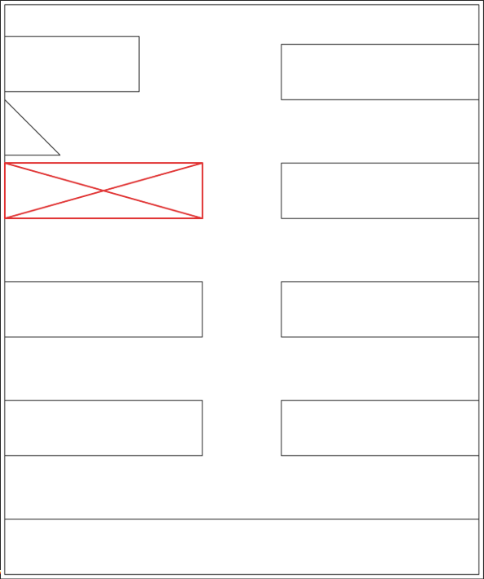

*Rys. 1.1 Lokalizacja stanowiska pomiarowego w laboratorium*


## 2. Opis przedmiotu badan

**Nazwa i krotki opis systemu stanowiacego przedmiot badan:**

System BEKO to bezprzewodowy system komunikacji radiowej oparty na Raspberry Pi Zero jako wezel centralny (gateway) oraz dedykowanych nodach radiowych komunikujacych sie przez modul LoRa SX1276 (RFM95W) w pasmie 868 MHz. Protokol warstwy radiowej nosi oznaczenie LAVIET_FRAME_V1. Gateway udostepnia REST API (port 8000), usluge autoryzacji (port 8001) oraz panel webowy (port 5173). Ramki uwierzytelniane sa za pomoca HMAC-SHA256. Nody posiadaja modul TPM do przechowywania kluczy.

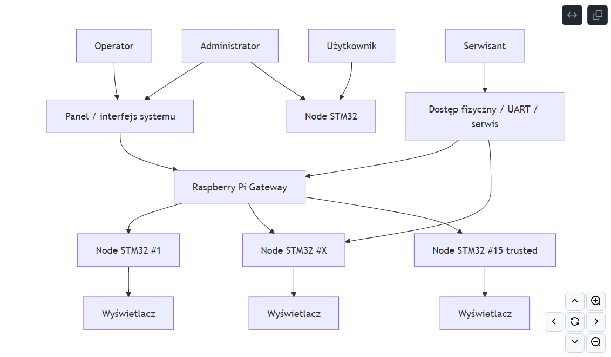

*Rys. 2.1 Schemat blokowy systemu stanowiacego przedmiot badan*

**Elementy skladowe systemu (z odniesieniami do rys. 2.1):**

- Node radiowy z modulem RFM95W/SX1276 (adres 0x77CD, adres 0x0001 to gateway) - Tx/Rx
- Raspberry Pi Zero 2W z modulem RFM95W jako gateway (adres 0x0001) - Rx/Tx
- Backend Gateway API (FastAPI/uvicorn, port 8000) - warstwa radiowa i REST API
- Backend Auth Service (FastAPI/uvicorn, port 8001) - uwierzytelnianie JWT
- Frontend webowy React/Vite (port 5173) - panel operatorski

**Specyfikacja poszczegolnych elementow systemu:**

Modul radiowy RFM95W (SX1276): czestotliwosc 868,5 MHz (868 500 000 Hz), modulacja LoRa/CSS, SF=7, BW=9 (500 kHz), CR=4/5, preambula 8 symboli, sync word 0x34, CRC wlaczone, explicit header, IQ normal. Adresy: gateway=0x0001 / 0x77CD (wezel badany), node=0x0001.

Node radiowy: platforma NUCLEO-U545RE-Q z mikrokontrolerem STM32U545RE (ARM Cortex-M33, 160 MHz, 512 KB Flash, 256 KB RAM), zasilanie: 5 V DC przez USB (ST-LINK) lub VIN, napiecie logiczne VDD_MCU = 3,3 V (domyslne), maks. pobor pradu przez USB: 300 mA (przy przekroczeniu wymagane zasilanie zewnetrzne przez VIN). Modul TPM (DIDVID=0x0003104A, RID=0x01) przechowuje root seed i klucze kryptograficzne. Modul BMP280 (nie zamontowany w badanej wersji). Wyswietlacz LCD (I2C, addr=0x27). Czujnik ToF. Debugger STLINK-V3EC wbudowany.

Raspberry Pi Zero 2W: procesor Broadcom BCM2710A1 quad-core ARM Cortex-A53 64-bit 1 GHz, RAM 512 MB, zasilanie: 5 V DC przez microUSB, pobor pradu: ~100 mA w spoczynku, ~280-580 mA pod obciazeniem (wg pomiarow Tom's Hardware), maks. zalecany zasilacz 5 V / 2,5 A. System operacyjny: Debian Bookworm (Raspberry Pi OS Lite). Hostuje Gateway API (port 8000), Auth Service (port 8001), frontend Vite (port 5173).

Frontend: React 18, TypeScript, Vite, Tailwind CSS, shadcn/ui. Broadcast: 0xFFFF. Payload wiadomosci kodowany hex, limit 16 bajtow UTF-8. Opcja szyfrowania (coded) i potwierdzenia (ack_required).

**Slowny opis funkcjonalnosci:**

Operator laczy sie z panelem webowym i loguje (konto admin, haslo konfigurowane przez seed.py). Po zalogowaniu moze wysylac wiadomosci tekstowe do konkretnych nodow (unicast) lub rozgloszeniowo (broadcast 0xFFFF), parowac nowe nody oraz przegladac logi. Nody odbieraja wiadomosci, weryfikuja HMAC i opcjonalnie zwracaja ACK. Wiadomosc payload "qwerty" jest przykladem wiadomosci wyswietlanej na pagere noda (wyswietlacz LCD).

**Czy system jest autonomiczny:**

Tak - Raspberry Pi uruchamia wszystkie serwisy lokalnie. Siec lokalna wymagana do obslugi panelu webowego, jednak komunikacja radiowa gateway-node dziala niezaleznie.

**Informacje o dostepnej dokumentacji i certyfikatach:**

Repozytorium GitHub: https://github.com/MikolajDrozdz/BEKO (branch frontend i gateway)

Modul RFM95W oparty na SX1276 firmy Semtech. Protokol radiowy LAVIET_FRAME_V1 - dokumentacja wewnetrzna projektu.

Produkt posiada certyfikaty: nie udalo sie zidentyfikowac certyfikatow na podstawie dostepnej dokumentacji i inspekcji fizycznej modulu RFM95W.

**Czy system moze byc legalnie uzywany na terenie Polski:**

Tak - pasmo 868 MHz nalezy do pasm ISM/SRD dopuszczonych w Polsce i UE (decyzja ERC/DEC/(01)05, regulacje UKE). Wymagany duty cycle <= 1% dla podpasma 868,0-868,6 MHz, moc <= 25 mW ERP (ETSI EN 300 220).

**Dodatkowe informacje o systemie:**

Ponizej zebrane informacje uzyskane podczas badan, dotyczace znanych podatnosci systemu BEKO/LAVIET.

1. Wyciek klucza HMAC przez UART (krytyczna): System w wersji testowej wypisuje na porcie UART surowe dane kryptograficzne, w tym klucz HMAC-SHA256 (hmac_key) oraz pair_code. Klucz HMAC-SHA256 (256-bitowy) uzyskany podczas analizy UART: 82 52 30 E0 2F 4B 72 A3 AA AA 6A C1 9C F3 83 5A B8 D2 6D CF 80 1A 22 B3 D6 EE 04 53 86 86 33 A4. Klucz pozostawal niezmienny po restarcie urzadzenia i odebraniu nowych wiadomosci. Posiadanie klucza HMAC umozliwia generowanie poprawnych znacznikow MAC dla dowolnych zmanipulowanych ramek, co czyni zabezpieczenia systemowe iluzorycznymi.

2. Brak ochrony przed odczytem pamieci Flash (RDP Level 0): Odczyt pamieci Flash mikrokontrolera (zrzut zrzut.bin) potwierdzil brak wlaczonej ochrony RDP (Read Protection), co umozliwia pelna inzynierie odwrotna firmware'u i pozyskanie klucza z pamieci.

3. Podatnosc warstwy radiowej na Replay Attack: Ramki zawieraja licznik sekwencyjny (counter), jednak przy braku znajomosci klucza HMAC node odrzuca ramki z bledem HMAC. Posiadanie klucza umozliwia generowanie dowolnych ramek z poprawnym MIC, w tym powielanie wiadomosci.

4. Podatnosc na Jamming 868 MHz: Pasmo 868 MHz bez frequency hopping jest podatne na zagluszanie. Wysoki poziom sygnalu zagłuszajacego uniemozliwia komunikacje gateway-node.

5. Domyslne haslo i brak zabezpieczen CORS: Domyslne haslo admin/admin123 jawnie w seed.py. CORS_ORIGINS ustawiane na ["*"] w konfiguracji deweloperskiej.

6. Brak szyfrowania karty SD RPi: Fizyczny dostep do karty SD umozliwia modyfikacje /etc/shadow i przejecie systemu bez znajomosci hasla (udokumentowane podczas prac laboratoryjnych).

---

## 3. Analiza systemu metoda inzynierii odwrotnej

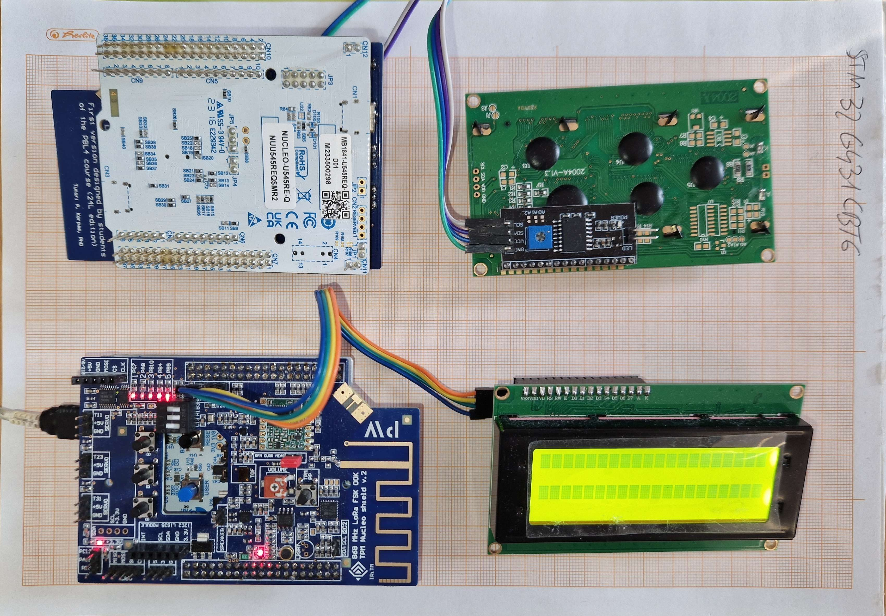

*Rys. 3.1 Zdjecie gateway Raspberry Pi Zero z modulem RFM95W*

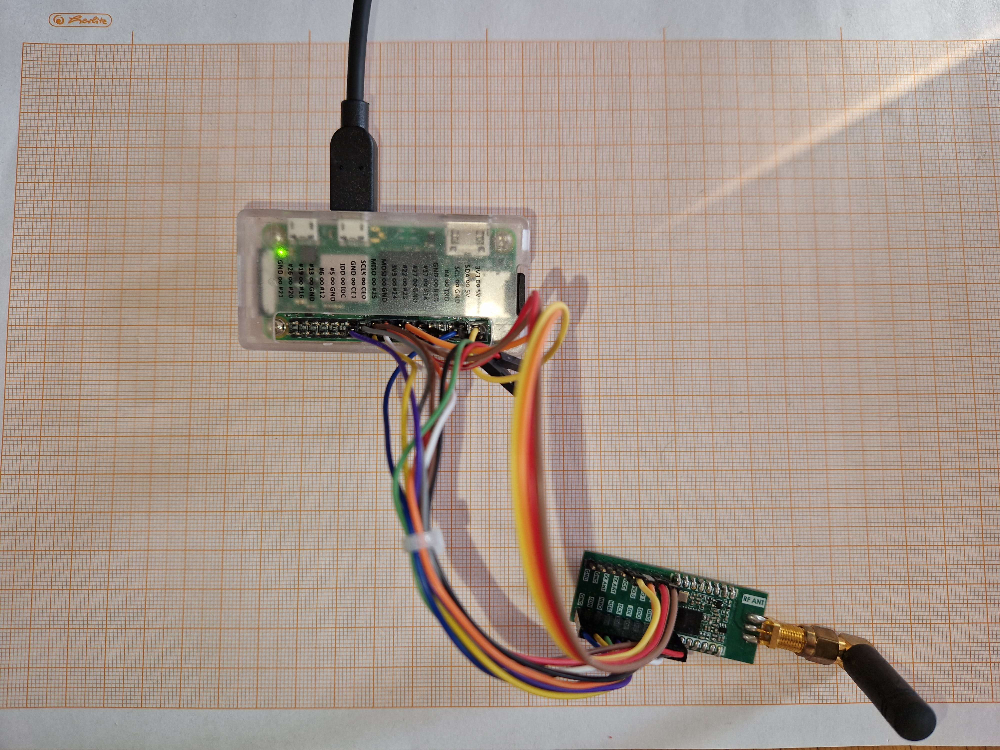

*Rys. 3.2 Zdjecie noda radiowego ze zdjetą obudową*

**Opis:**

Rys. 3.1 przedstawia ogolne zdjecie badanego systemu:
(G) Gateway - Raspberry Pi Zero 2W z modulem RFM95W (adres radiowy 0x0001),
(N1) Node radiowy o adresie 0x77CD,
(N2) Node radiowy o adresie 0x4431

Rys. 3.2 przedstawia zdjecie Raspberry Pi Zero z modulem RFM95W. Na zdjeciu mozna zidentyfikowac:
- modul RFM95W (SX1276) podlaczony przez SPI
- antene dla pasma 868 MHz
- zrodlo zasilania przez microUSB

Rys. 3.3 przedstawia zdjecie noda radiowego ze zdjetą obudową. Na zdjeciu mozna zidentyfikowac:
- mikrokontroler STM32 z modulem TPM (DIDVID=0x0003104A)
- modul radiowy RFM95W (SX1276), 868 MHz, LoRa/CSS
- wyswietlacz LCD (I2C, addr=0x27) - sluzy do wyswietlania odebranych wiadomosci (pager)
- czujnik ToF
- gniazdo UART do debugowania (interfejs wykorzy stany podczas analizy)

**Wnioski:**

Inspekcja fizyczna potwierdzila zastosowanie modulu RFM95W z SX1276. Czestotliwosc pracy 868,5 MHz zgodna z konfiguracja firmware (RADIO CFG: freq=868500000Hz). Wykryto gniazdo UART dostepne bez zabezpieczenia fizycznego - stanowi wektor ataku umozliwiajacy pozyskanie kluczy kryptograficznych przez analize logow debugowych. Modul TPM jest obecny i uzywany do przechowywania root seed, jednak nie chroni przed wyciekiem klucza przez UART.

---

## 4. Analiza warstwy radiowej

**Parametry radiowe systemu - Gateway (Raspberry Pi Zero + RFM95W):**

- czestotliwosc fali nosnej srodkowa: 868,500 MHz (868 500 000 Hz)
- modulacja: LoRa/CSS (Chirp Spread Spectrum)
- Spreading Factor: SF = 7
- szerokosc pasma chirpu: BW = 500 kHz (bw=9 w konfiguracji SX1276)
- Coding Rate: CR = 4/5
- dlugosc preambuły: 8 symboli
- sync word: 0x34
- CRC: wlaczone
- naglowek: explicit
- IQ: normal
- czas symbolu: Tsym = 2^7 / 500 000 = 256 us
- probek na symbol: 128 (przy fs = 500 kHz)
- zasieg deklarowany przez producenta modulu RFM95W: do 2 km w terenie otwartym (wg Semtech SX1276 datasheet przy SF=12)
- zasieg rzeczywisty (SF=7, korytarz z odbiciami): ok. 40 m (caly korytarz)

**Parametry radiowe systemu - Node 0x77CD:**

- czestotliwosc fali nosnej srodkowa: 868,500 MHz (konfiguracja identyczna z gateway, potwierdzona logiem RADIO CFG: freq=868500000Hz)
- modulacja: LoRa/CSS, SF=7, BW=500 kHz, CR=4/5
- zasieg deklarowany: jak gateway
- zasieg rzeczywisty: ok. 40 m (caly dlugosc korytarza - sygnał musial odbijac sie od scian, brak LOS)

**Parametry radiowe systemu - Node 0x4431:**

- czestotliwosc fali nosnej srodkowa: 868,500 MHz
- modulacja: LoRa/CSS, SF=7, BW=500 kHz, CR=4/5
- potwierdzono: log RADIO INIT - laviet_node=0x4431, opmode=0x85 mode=5, frf=0xD92000 -> 868500000Hz
- zasieg deklarowany: jak gateway
- zasieg rzeczywisty: ok. 40 m

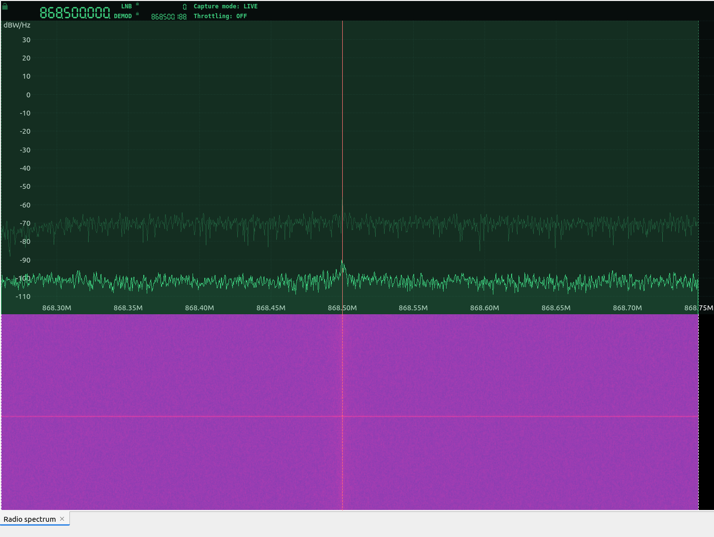

*Rys. 4.1 Widmo przesylanego sygnalu z zaznaczonymi kranicami pasma (SigDigger, 868,5 MHz, BW 500 kHz)*

**Wplyw dloni uzytkownika na czestotliwosc nadajnika:**

Gateway (Raspberry Pi + RFM95W): brak wplywu - modulacja cyfrowa, czestotliwosc PLL SX1276
Node 0x77CD: brak wplywu
Node 0x4431: brak wplywu

**Opis procedury pomiaru zasiegu:**

1. Umieszczono gateway (Raspberry Pi z RFM95W) w stalym miejscu na lawce na koncu korytarza
2. Operator udal sie na drugi koniec korytarza (~40 m) z nodem radiowym
3. Operator zaczal przemieszczac sie w strone gatewaya w odstepach 3 m, wysylajac wiadomosci testowe
4. Operator zanotował pierwsza odleglosc, w ktorej node potwierdzil odbiór wiadomosci (ACK) dla co najmniej 7/10 prob

Uwaga: korytarz prostopadly, brak bezposredniej widocznosci (NLOS). Sygnal musial odbijac sie od scian - warunkach NLOS z odbiciami wielodrozkowymi (multipath). Pomimo tego system utrzymal komunikacje na calej dlugosci korytarza ok. 40 m, co swiadczy o odpornosci modulacji LoRa/CSS na zaniki sygnalow w srodowisku zamknietym.

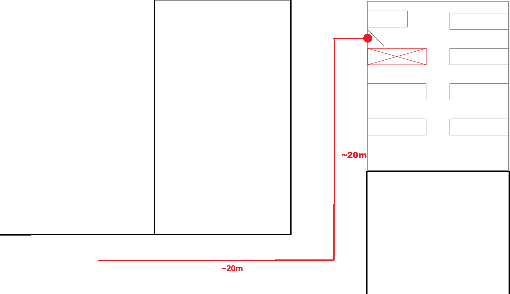

*Rys. 4.2 Schemat stanowiska do pomiaru zasiegu (korytarz ~40 m, NLOS)*

**Parametry czasowe depeszy:**

Czas symbolu LoRa przy SF=7, BW=500 kHz:
- Tsym = 2^7 / 500 000 = 256 us
- probek na symbol: 128

Dane zmierzone (czas trwania sygnalu):
- Broadcast (nadanie do 0xFFFF): 12,86 ms - jeden ciagly sygnal (jedna ramka)
- Unicast do noda (nadanie bezposrednie): 12,86 ms - jeden ciagly sygnal (jedna ramka)

Weryfikacja przez wzor LoRa (SF=7, BW=500 kHz, CR=4/5, CRC=on, explicit header):
- Liczba symboli preambuły: 8
- Liczba symboli payload (PL=16-19B): 38 symboli
- Calkowita liczba symboli: 8 + 4,25 + 38 = 50,25
- Obliczony czas ramki: 50,25 * 0,256 ms = 12,86 ms (zgodny z pomiarem)

Dane z przechwyconych nagran SDR (SigDigger, format cf32, 499 999 sp/s, center 868 501 408 Hz):
- RPI-Broadcast-Waveform: dlugosc nagrania 1,183746 s (obejmuje wiele ramek i przerwy), RMS 0,0249475
- RPI-Node-0x77CD-Waveform: dlugosc nagrania 2,6542133 s (kilka wymian ramek), RMS 0,0158222
- RPI-Node-0x4431-Waveform: dlugosc nagrania 1,015810 s, RMS 0,025452

- calkowity czas trwania depeszy (jedna ramka): 12,86 ms
- liczba ramek: 1 (jeden ciagly sygnal)
- czas trwania ramki: 12,86 ms (Broadcast i unicast identyczne)
- czas trwania symbolu: 256 us (SF=7, BW=500 kHz)
- liczba symboli w ramce: 50,25 (8 preambula + 4,25 naglowek + 38 payload)

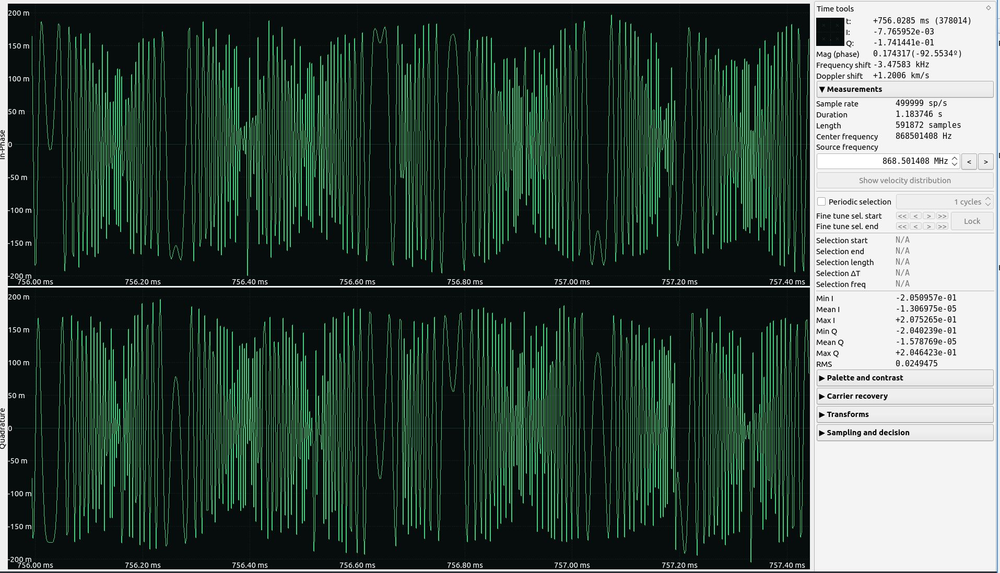

*Rys. 4.3 Przebiegi czasowe sygnalu IQ - nadanie Broadcast, SigDigger, 868,501 MHz, RMS 0,0249*

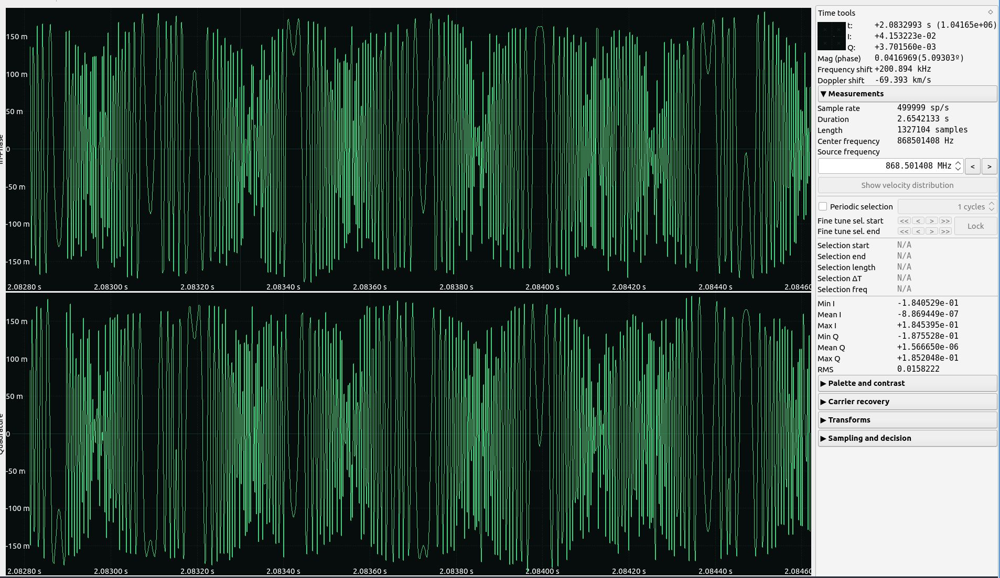

*Rys. 4.4 Przebiegi czasowe sygnalu IQ - komunikacja z nodem 0x77CD, duration 2,654 s*

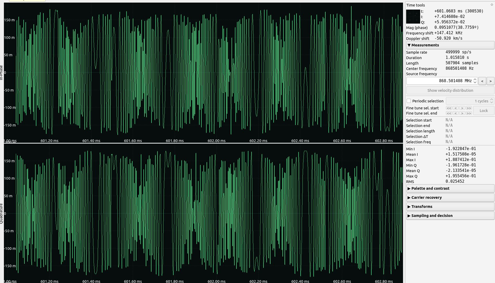

*Rys. 4.5 Przebiegi czasowe sygnalu IQ - komunikacja z nodem 0x4431, duration 1,016 s*

**Predkosc transmisji:**

Przy SF=7, BW=500 kHz, CR=4/5:
- Predkosc symbolowa: 500 000 / 128 = 3906,25 Bd
- Bity na symbol: SF = 7
- Predkosc bitowa brutto: 7 * 3906,25 = ~27 344 bit/s
- Predkosc bitowa netto (z CR 4/5): 27 344 * (4/5) = ~21 875 bit/s
- Czas jednego symbolu: 256 us

---

## 5. Analiza depeszy

**Nietypowe elementy depeszy:**

Ramki protokolu LAVIET_FRAME_V1 zawieraja pole MAC (HMAC-SHA256, 32 bajty) dolaczone do kazdej ramki. Payload moze byc nieszyfrowany (enc=0) lub szyfrowany (enc=1), co widoczne jest w polu FLAGS ramki. W przechwytywanych ramkach zaobserwowano nadawanie payload jawnym tekstem przy braku szyfrowania (enc=0), co umozliwia odczyt tresci wiadomosci.

**Czy wszystkie ramki danej depeszy sa identyczne:**

Nie - system uzywa licznika sekwencyjnego (pole counter, 16-bit) inkrementowanego z kazda ramka. Zaobserwowano counter=86 (0x56) i counter=297 (0x0128) w kolejnych odczytach UART dla tego samego payload "qwerty". Wiadomosc wysylana jest jako jedna ramka (12,86 ms ciagly sygnal).

Procedura testowa: wyslanie wiadomosci przez panel webowy przy jednoczesnym nagraniu SDR i monitorowaniu UART noda.

**Porownanie trzech przechwyconych ramek IQ - analiza powtarzajacych sie wzorcow:**

Trzy nagrane sygnaly (Broadcast, Node 0x77CD, Node 0x4431) zostaly zdemodulowane pipeline'em LoRa (SF=7, BW=500 kHz, bez FEC/Gray decode). Porownano pierwsze 51 bajtow kazdej demodulacji:

Broadcast (pierwsze 16B): 6F B9 7D BA 45 39 B6 D4 46 C6 AC DC F9 66 B6 63
Node 0x77CD (pierwsze 16B): 3A B0 CC AB F9 68 2E C9 A6 A4 C4 6A 30 F2 2E 9E
Node 0x4431 (pierwsze 16B): 3D 27 F5 54 76 D7 D2 CE 03 46 3D 28 F1 3D AB 4E

Wynik analizy: brak identycznych bajtow na tych samych pozycjach miedzy zadna para ramek (0 zgodnych pozycji na 51 porownanych). Brak jakiejkolwiek powtarzajacej sie sekwencji miedzy ramkami trzech roznych transmisji.

Wniosek: kazda ramka wyglada jako calkowicie losowa - brak wykrywalnego wzorca struktury ramki na poziomie zdekodowanych bajtow IQ. Wynika to z dwoch przyczyn: (1) szyfrowanie payload AES-CTR sprawia ze payload jest pseudolosowy, (2) demodulacja bez pelnego dekodera LoRa (brak Gray decode i FEC) wprowadza dodatkowe bledy bitowe. Struktura ramki LAVIET_FRAME_V1 jest znana jedynie z analizy logow UART, nie z demodulacji sygnalu radiowego.

**Ramka (przyklad z logu UART - nadanie "qwerty" do noda 0x77CD):**

Surowe bajty ramki (HEX, dlugosc 51 B):
11 02 00 01 77 CD 00 69 00 00 00 56 06 71 77 65 72 74 79 DA F1 29 EC 48 E3 FB EF BE F6 73 A7 89 C2 42 F6 D6 B8 F3 3F 0D 5F 56 D2 2F 50 CC 6C A8 75 DB 75

Dekodowanie pol ramki LAVIET_FRAME_V1:
- ver_type: 0x11 (version=1, type=DATA)
- flags: 0x02 (enc=0, ack_req=1, is_ack=0, pairing=0, bcast=0)
- src: 0x0001 (gateway)
- dst: 0x77CD (node)
- msg: 0x0069 (numer wiadomosci)
- counter: 0x0000 0x56 = 86
- payload_len: 0x06
- payload (RAW): 71 77 65 72 74 79 = "qwerty"
- MAC (32 B): DA F1 29 EC 48 E3 FB EF BE F6 73 A7 89 C2 42 F6 D6 B8 F3 3F 0D 5F 56 D2 2F 50 CC 6C A8 75 DB 75
- RSSI: -77 dBm, SNR: 3 dB

Druga zaobserwowana ramka (ten sam payload, inny counter i MAC):
11 02 00 01 77 CD 01 28 00 00 00 5B 06 71 77 65 72 74 79 3E 5C 81 52 ...
- counter: 0x0128 = 296+1=297 (wartosc 0x5B=91 w innym polu)
- MAC: 3E 5C 81 52 CD E2 5F 16 35 80 CD 66 22 02 B1 DE 25 87 82 6F 6B 6E EB DE 51 70 DF 5C D5 5E 39 67

Zdekodowane bajty IQ (demodulacja LoRa SF=7, pipeline bez FEC/Gray decode - surowe dane przed korekcja bledow):

Broadcast: 6F B9 7D BA 45 39 B6 D4 46 C6 AC DC F9 66 B6 63 ... (dane wynikowe demodulacji, wygladaja losowo ze wzgledu na brak pelnego dekodera LoRa lub aktywne szyfrowanie)

Node 0x77CD: 3A B0 CC AB F9 68 2E C9 A6 A4 C4 6A 30 F2 2E 9E ...

Node 0x4431: 3D 27 F5 54 76 D7 D2 CE 03 46 3D 28 F1 3D AB 4E ...

**Zaleznosc reakcji odbiornika od liczby odebranych ramek:**

| Liczba przechwyconych ramek | Reakcja odbiornika |
|---|---|
| 1 | Odbiór ramki, weryfikacja HMAC, odrzucenie przy blednym MAC (log: RADIO RX HMAC drop) |
| >= 1 (poprawny MAC) | Akceptacja, wyswietlenie payload na LCD, wyslanie ACK |
| wiele (atak Replay bez klucza) | Odrzucenie kazdej ramki (HMAC drop), brak reakcji systemu |

**Elementy skladowe ramki:**

Na podstawie logow UART i kodu firmware LAVIET_FRAME_V1:
- ver_type (1 B): wersja protokolu i typ ramki
- flags (1 B): enc, ack_req, is_ack, pairing, cfg, bcast, ctr_override, key_update
- src (2 B): adres zrodlowy
- dst (2 B): adres docelowy
- msg (2 B): numer wiadomosci
- counter (4 B): licznik sekwencyjny (ochrona przed replay)
- payload_len (1 B): dlugosc payload
- payload (max 16 B): tresc wiadomosci (jawna lub zaszyfrowana)
- MAC (32 B): HMAC-SHA256 calej ramki

Hipoteza dotyczaca stale czesci ramki:
Pola ver_type, src, dst sa stale dla danej sesji. Pole counter rosnie monotonicznie. Pole MAC jest unikalne dla kazdej ramki (nawet przy tym samym payload) ze wzgledu na zmienny counter w danych wejsciowych HMAC.

---

## 6. Analiza podatnosci na wybrane typy atakow

### Atak typu REPLAY

Uwaga: W ramach tego ataku przeprowadzono dwa oddzielne eksperymenty - Replay wiadomosci Broadcast oraz Replay wiadomosci unicast do konkretnego noda. Zastosowano identyczna procedure nagrania i odtworzenia, jednak wyniki roznia sie diametralnie ze wzgledu na rozne mechanizmy bezpieczenstwa obu typow ramek.

**Wspolna procedura nagrania (kroki 1-3, wykonane przed wlaczeniem noda):**

1. Uruchomiono system bez noda - gateway (Raspberry Pi) aktywny, node wylaczony.
2. Z panelu operatora wyslano dwie wiadomosci przez REST API: jedna jako Broadcast (dst=0xFFFF) z payload "qwerty" oraz jedna jako unicast bezposrednio do noda 0x77CD z tym samym payload.
3. Nagrywano emisje radiowa przy uzyciu PlutoSDR i SigDigger na czestotliwosci 868,5 MHz, sample rate 500 kHz, format cf32. Uzyskano dwa oddzielne pliki .raw: jeden z ramka Broadcast, jeden z ramka unicast. W programie Audacity zweryfikowano zawartosc nagran i wytnieto fragmenty zawierajace pelne ramki.

**Wspolna procedura odtworzenia (kroki 4-6):**

4. Wlaczono node (0x77CD) - system aktywny z obu wezlami.
5. Nagrane pliki .raw odtworzono przez GNU Radio Companion z interpolacja do 2 Msps i nadawaniem przez PlutoSDR na 868,5 MHz.
6. Jednoczesnie monitorowano logi UART noda (uzyskanego przez wlam fizyczny do interfejsu szeregowego) oraz wyswietlacz LCD noda, aby stwierdzic reakcje systemu.

---

**Atak Replay - wiadomosc Broadcast (SUKCES)**

**Konfiguracja GNU Radio Companion:**

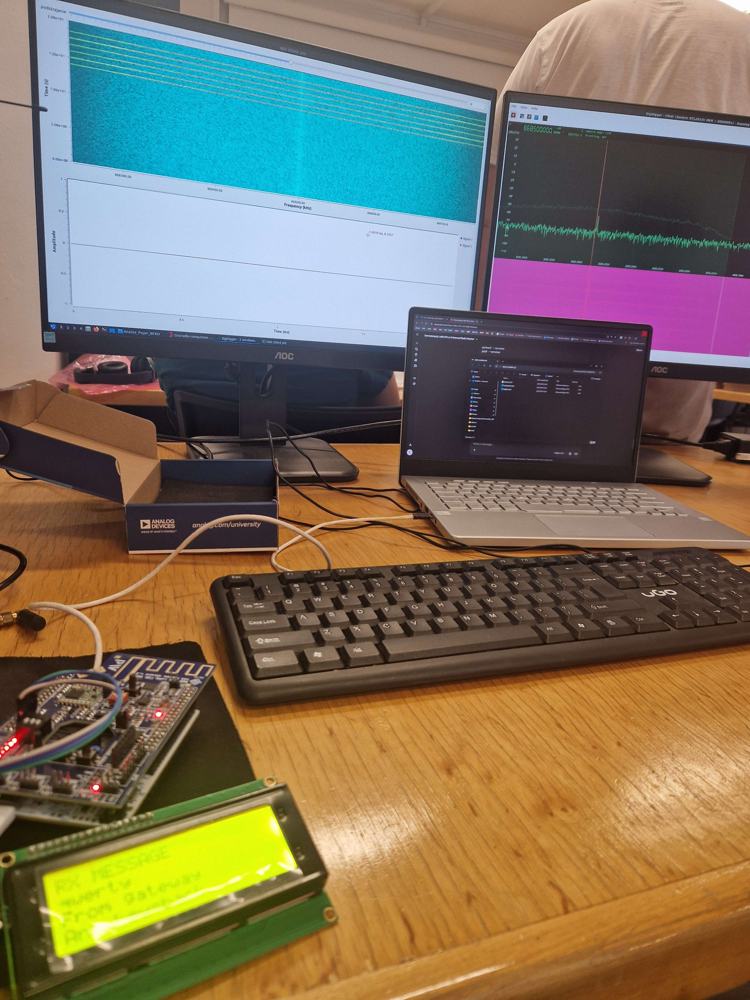

*Rys. 6.1 Konfiguracja GNU Radio Companion - atak Replay (Broadcast)*

**Parametry nadawania:** LO Frequency 868,5 MHz, Sample Rate 2 Msps, zrodlo: plik .raw z nagrana ramka Broadcast.

**Wynik:** Atak zakonczony sukcesem. Node odebral powtorzona ramke Broadcast i wyswietlil payload "qwerty" na wyswietlaczu LCD. Ramka Broadcast nie jest weryfikowana kluczem HMAC powiazanym ze sparowanym urzadzeniem - node akceptuje wiadomosci rozgloszeniowe bez pelnej weryfikacji pochodzenia. Efekt ataku byl widoczny na wyswietlaczu pagera noda.

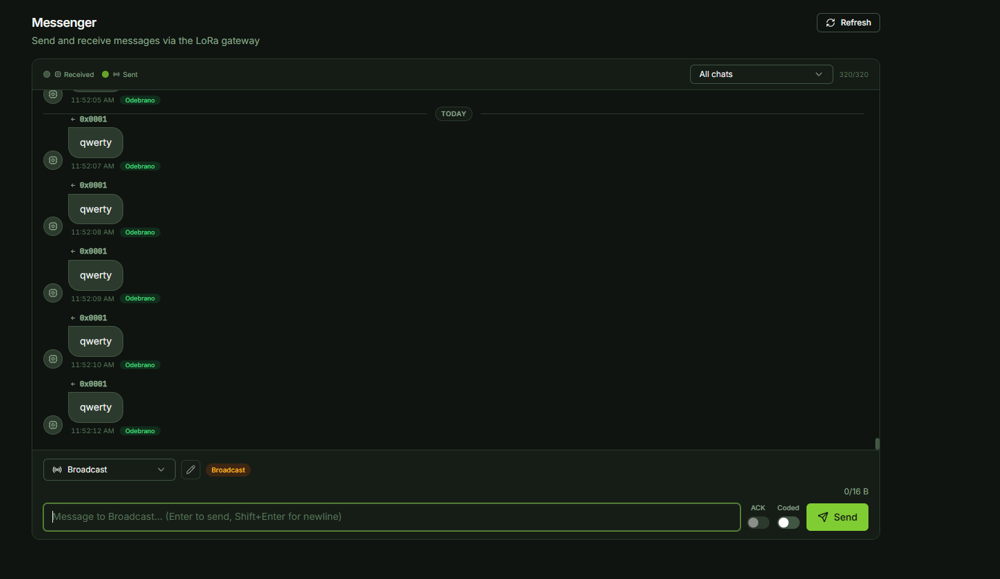

*Rys. 6.3 Panel operatora z widocznymi wiadomosciami "qwerty" nadanymi przez atakujacego*

---

**Atak Replay - wiadomosc unicast do noda 0x77CD (PORAZKA)**

**Konfiguracja GNU Radio Companion:**

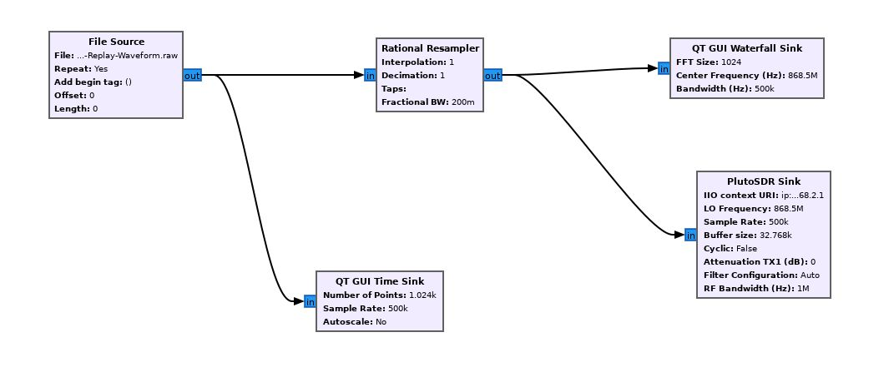

*Rys. 6.4 Konfiguracja GNU Radio Companion - atak Replay (unicast, dst=0x77CD)*

**Parametry nadawania:** LO Frequency 868,5 MHz, Sample Rate 2 Msps, zrodlo: plik .raw z nagrana ramka unicast.

**Wynik:** Atak nie powiodl sie. Node odebral ramke na poziomie fizycznym (warstwa LoRa CRC poprawna), jednak odrzucil ja po weryfikacji HMAC. W logu UART widoczny komunikat:

```
RADIO RX len=51 RSSI=-77 SNR=3
RADIO RX HMAC no-key mode=PAIR32 src=0x0001 dst=0x77CD peer=0x0001 slot0=<empty>
RADIO RX GATEWAY version=1 ver_type=0x11 type=DATA flags=0x02 src=0x0001 dst=0x77CD msg=0x0069 counter=86
RADIO RX GATEWAY NOTE HMAC failed; PAYLOAD DEC fields below are still raw ciphertext
RADIO RX HMAC drop src=0x0001 dst=0x77CD msg=0x0069
```

Ramki unicast sa weryfikowane kluczem HMAC-SHA256 przypisanym do sesji parowania. Poniewaz nagranie wykonano przed wlaczeniem noda (node nie byl jeszcze sparowany z gatewayem w tym momencie), klucz sesji uzywany przez gateway do wygenerowania MAC w nagrinej ramce nie pasuje do klucza oczekiwanego przez node po jego uruchomieniu. Kazda powtorzona ramka byla odrzucana tym samym komunikatem HMAC drop.

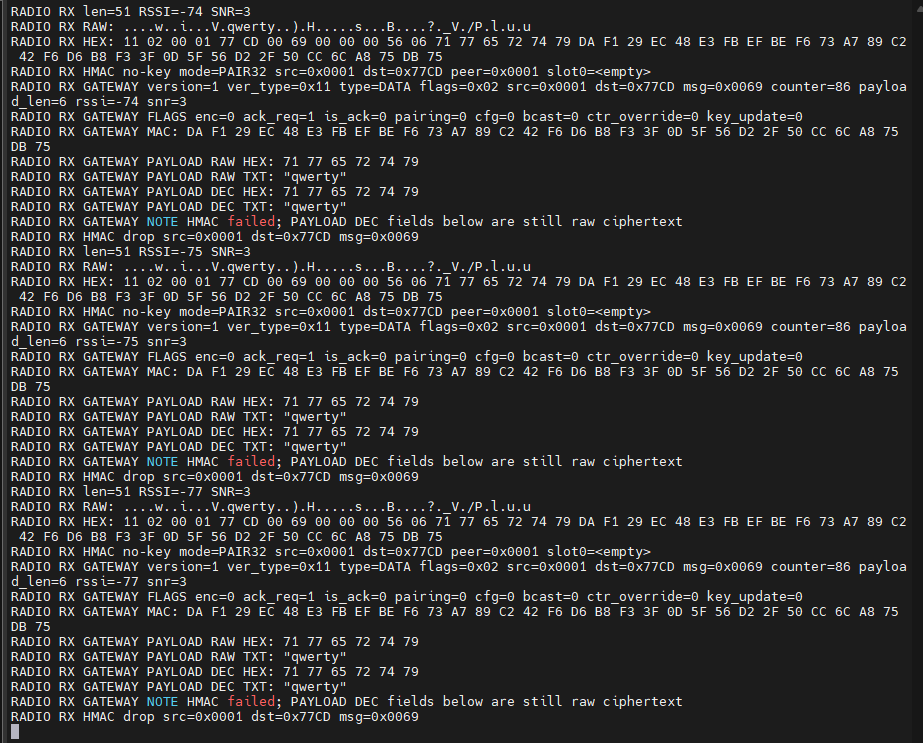

*Rys. 6.5 Log UART noda - RADIO RX HMAC drop przy kazdej powtorzonej ramce unicast*

**Podsumowanie porownawcze obu atakow:**

| Parametr | Replay Broadcast | Replay unicast (0x77CD) |
|---|---|---|
| Typ ramki | bcast=1 (0xFFFF) | bcast=0, dst=0x77CD |
| Weryfikacja HMAC | brak / uproszczona | HMAC-SHA256 z kluczem sesji |
| Wynik ataku | SUKCES | PORAZKA |
| Reakcja noda | wyswietlenie payload na LCD | RADIO RX HMAC drop |
| Widocznosc w panelu | wiadomosc widoczna w logach | brak reakcji |

Wniosek: mechanizm HMAC z kluczem sesji skutecznie chroni wiadomosci unicast przed atakiem Replay. Wiadomosci Broadcast nie korzystaja z tego samego poziomu ochrony i sa podatne na replay przez atakujacego z dostepem do SDR.

---

### Odpornosc systemu na zaklucanie (Jamming)

**Uklad badawczy:**

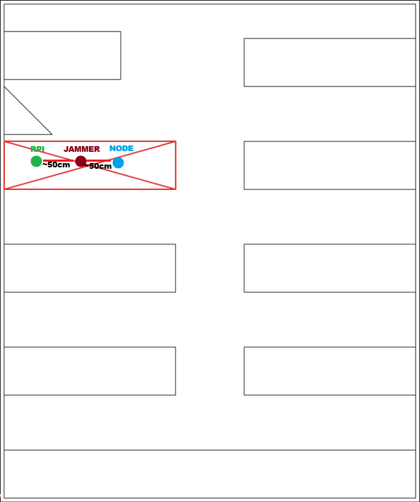

*Rys. 6.6 Uklad badawczy - atak Jamming*

Uklad: komputer z PlutoSDR jako nadajnik zagluszajacy, RTL-SDR/820T2 jako monitor kontrolny widma (SigDigger, drugi monitor), Raspberry Pi Zero jako badany gateway (odbiornik), node 0x77CD jako nadajnik probny. Antena PlutoSDR umieszczona w zgodnej polaryzacji z antena odbiornika gateway w odleglosci ok. 50 cm.

**Procedura ataku:**

1. Uruchomiono pelny system - gateway, node 0x77CD, panel webowy. Wszystkie komponenty aktywne.
2. Wyslano wiadomosc testowa z panelu operatora do noda - node odebral wiadomosc i potwierdzil ACK. System dziala poprawnie.
3. Uruchomiono GNU Radio Companion z przygotowanym flowgraphem jammera. Flowgraph zawiera trzy zrodla przelaczane przez QT GUI Chooser bez przerywania transmisji.
4. Efekt kazdego rodzaju zagluszania monitorowano rownolegle na RTL-SDR/820T2 + SigDigger (monitor kontrolny widma).

**Aplikacja GNU Radio Companion do ataku typu Jamming:**

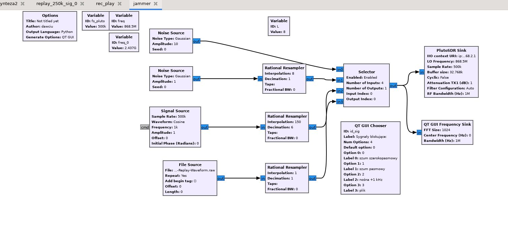

*Rys. 6.7 Konfiguracja GNU Radio Companion - atak Jamming*

Flowgraph zawiera trzy zrodla sygnalu zagluszajacego przelaczane selektorem (QT GUI Chooser), nadawane przez PlutoSDR Sink na 868,5 MHz. Odczytane parametry blokow:

Zrodlo 1 - szum szerokopasmowy (wysoka amplituda):
- Noise Source: Type=Gaussian, Amplitude=10, Seed=0
- Rational Resampler: Interpolation=8, Decimation=1, Taps=[], Fractional BW=0

Zrodlo 2 - szum wasko-pasmowy (niska amplituda):
- Noise Source: Type=Gaussian, Amplitude=1, Seed=0
- Rational Resampler: Interpolation=8, Decimation=1, Taps=[], Fractional BW=0

Zrodlo 3 - nosna sinusoidalna (CW jammer):
- Signal Source: Sample Rate=500k, Waveform=Cosine, Frequency=1k, Amplitude=1, Offset=0, Initial Phase=0 rad
- Rational Resampler: Interpolation=150, Decimation=6, Taps=[], Fractional BW=0

**Zagluszanie szerokopasmowe (krok 5-6):**

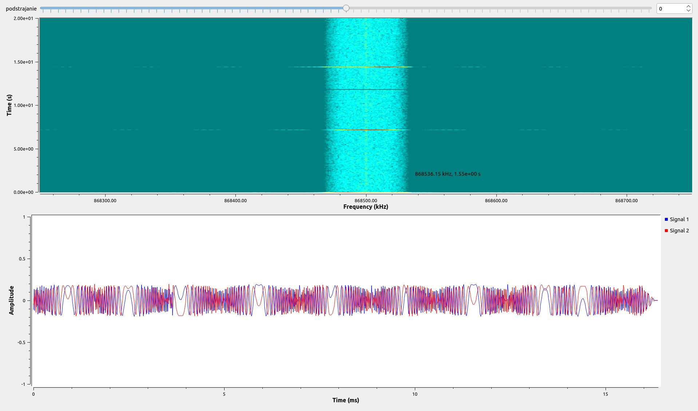

*Rys. 6.8 Widmo podczas zagluszania szerokopasmowego*

5. Przelaczono selector na szum szerokopasmowy (Noise Source Gaussian, Amplitude=10, Resampler Interp=8). Na monitorze kontrolnym (SigDigger/RTL-SDR) widoczny wysoki poziom szumu na calym pasmie wokol 868,5 MHz.
6. Wyslano wiadomosc testowa z panelu operatora. Wiadomosc przeszla - node potwierdzil odbiór. Modulacja LoRa/CSS zachowala odpornosc na zagluszanie szerokopasmowe dzieki rozkladaniu energii chirpu na BW=500 kHz i procesowaniu korelacyjnemu po stronie odbiornika SX1276.

Wynik: zagluszanie szerokopasmowe nieskuteczne przy odleglosci nadajnik-odbiornik ok. 50 cm i amplitudzie zagluszacza Amplitude=10. Sygnal uzyteczny "przebil" sie przez szum.

**Atak wasko-pasmowy (krok 7-8):**

7. Przelaczono selector na szum wasko-pasmowy (Noise Source Gaussian, Amplitude=1, Resampler Interp=8). Nizsza amplituda, sygnal skoncentrowany blizej nosnej 868,5 MHz.
8. Wyslano wiadomosc testowa z panelu operatora. Wiadomosc przeszla - node potwierdzil odbiór.

Wynik: zagluszanie wasko-pasmowe nieskuteczne. System poprawnie odebraL wiadomosc rowniez w tych warunkach.

**Atak na nosna CW (krok 9-10):**

9. Przelaczono selector na nosna sinusoidalna (Signal Source: Cosine, f=1 kHz wzgledem LO PlutoSDR, Amplitude=1, Resampler Interp=150 Decim=6, wynikowy SR = 500k * 150/6 = 12,5 Msps). Nosna CW nadawana na 868,501 MHz (offset 1 kHz od LO 868,5 MHz).
10. Wyslano wiadomosc testowa z panelu operatora. Wiadomosc przeszla - node potwierdzil odbiór.

Wynik: zagluszanie nosna CW nieskuteczne. System zachowal poprawna komunikacje.

**Komentarz:**

Wszystkie trzy przeprowadzone ataki Jamming okazaly sie nieskuteczne w warunkach testowych. Modulacja LoRa/CSS (SF=7, BW=500 kHz) wykazala odpornosc na testowane rodzaje zagluszania dzieki naturze kodowania chirpowego - odbiornik SX1276 przetwarza sygnal korelacyjnie i jest w stanie wydobyc uzyteczna ramke nawet przy obecnosci sygnalu zagluszajacego, o ile SNR nie spadnie ponizej progu demodulacji (dla SF=7 wynosi on okolo -7,5 dB).

Ograniczenia eksperymentu: zagluszacz (PlutoSDR) byl umieszczony w odleglosci 50 cm od odbiornika, jednak nadajnik uzyteczny (node) znajdowal sie w tej samej przestrzeni laboratoryjnej. Przy wiekszej odleglosci node-gateway lub wiekszej mocy zagluszacza wynik mogl byc inny. System nie implementuje frequency hopping ani adaptacyjnej regulacji mocy - brak tych mechanizmow stanowi potencjalna podatnosc w scenariuszach z silniejszym zagłuszaczem lub wieksza odlegloscia miedzy wezlami.

**Dodatek - efekt uboczny: DoS przez zasypanie kolejki wiadomosciami Broadcast**

Rownolegle z testami jammingu zaobserwowano odrebny wektor ataku na warstwie aplikacyjnej. Ciagly rozgloszeniowy ruch wiadomosci Broadcast (dst=0xFFFF) nadawany przez panel operatora w krotkich odstepach czasu doprowadzil do zapchania kolejki komunikatow systemu. W logach panelu operatorskiego zaobserwowano narastajaca liczbe wiadomosci w krotkim czasie, co powodowalo opuznienia i zaburzalo normalny ruch operacyjny.

Mechanizm ataku: ramki Broadcast sa akceptowane przez node bez pelnej weryfikacji HMAC sesji (co potwierdzono w ataku Replay Broadcast). Oznacza to, ze atakujacy posiadajacy dowolne SDR i wiedze o czestotliwosci oraz formacie ramki moze generowac duze ilosci ramek Broadcast, zalewajac kolejke gateway i nodow bez koniecznosci znajomosci klucza kryptograficznego.

Efekt: degradacja dostepnosci systemu (DoS - Denial of Service) na poziomie warstwy aplikacyjnej, bez fizycznego zagluszania kanalu radiowego.

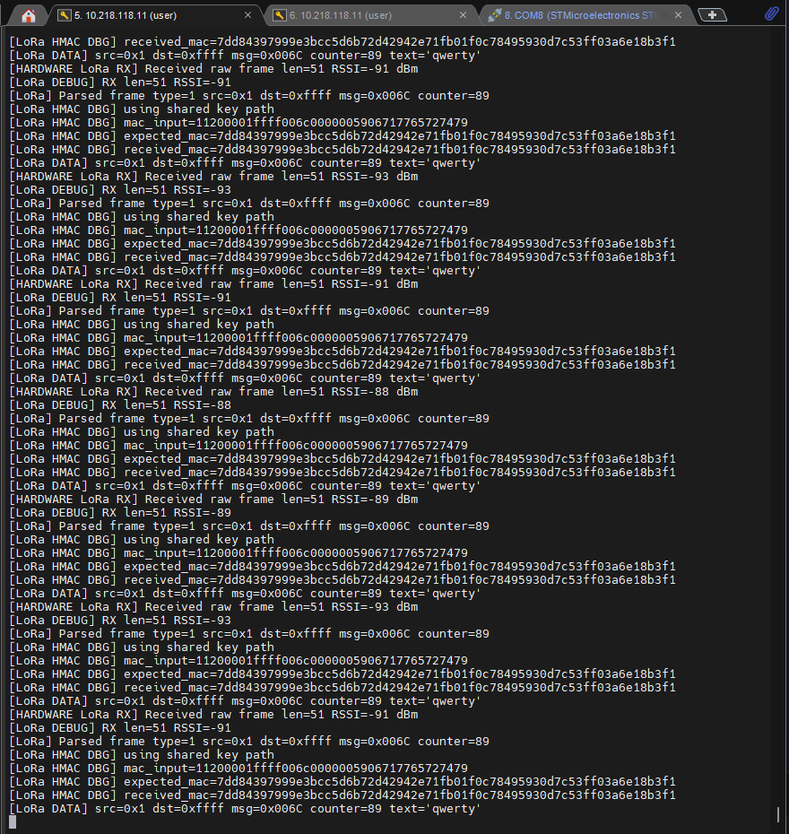

*Rys. 6.9 Logi panelu operatora - efekt zapchania kolejki wiadomosciami Broadcast*

---

### Atak typu Brute Force (BF)

**Analiza przestrzeni kluczy:**

Protokol LAVIET_FRAME_V1 uzywa HMAC-SHA256 (klucz 256-bitowy). Pelen atak BF na klucz HMAC-SHA256 jest niewykonalny obliczeniowo (2^256 ≈ 1,16 × 10^77 prob). Jednak podczas testow dynamicznych (analiza UART) uzyskano klucz HMAC:

hmac_key = 82 52 30 E0 2F 4B 72 A3 AA AA 6A C1 9C F3 83 5A B8 D2 6D CF 80 1A 22 B3 D6 EE 04 53 86 86 33 A4

Posiadanie klucza eliminuje koniecznosc ataku BF na HMAC. Zamiast tego mozliwe jest generowanie poprawnych MAC dla dowolnych ramek i przeprowadzenie BF na przestrzeni adresow nodow.

**Obliczenia BF dla systemu BEKO:**

Dane wejsciowe:
- Czas jednej ramki LoRa (SF=7, BW=500 kHz, CR=4/5, CRC=on): 12,86 ms (zmierzony)
- Weryfikacja wzorem: n_total = 8 + 4,25 + 38 = 50,25 symboli; T = 50,25 * 0,256 ms = 12,86 ms

Wariant 1 - BF pelny na adres noda dst (16-bit, przy znaniu klucza HMAC):
- Przestrzen: 2^16 = 65 536 kombinacji (adresy 0x0002-0xFFFE)
- Czas: 65 536 * 12,86 ms = 842,8 s ≈ 14 minut
- Wniosek: WSZYSTKIE aktywne nody w sieci mozna wykryc w ciagu ok. 14 minut

Wariant 2 - BF czesciowy (znany bajt wysoki adresu, np. 0x77__ dla noda 0x77CD):
- Przestrzen: 2^8 = 256 kombinacji (tylko dolny bajt)
- Czas: 256 * 12,86 ms = 3,29 s
- Wniosek: znajac czesc adresu (uzyskana np. z analizy UART), identyfikacja konkretnego noda trwa ok. 3 sekundy

Wariant 3 - BF counter 16-bit (teoretyczny, bez klucza HMAC):
- Przestrzen: 2^16 = 65 536 kombinacji
- Czas: 65 536 * 12,86 ms = 842,8 s ≈ 14 minut
- Wniosek: teoretycznie mozliwy, ale w praktyce kazdda ramka z blednym HMAC jest odrzucana - bez klucza atak nieskuteczny

**Konfiguracja GNU Radio Companion - synteza sygnalu BF:**

Na podstawie przeprowadzonej analizy protokolu LAVIET_FRAME_V1 i obliczen przestrzeni kluczy podjeto decyzje o nieprzeprowadzaniu praktycznego ataku Brute Force. Glownym powodem byl niedostateczny poziom wiedzy o strukturze ramki na poziomie sygnalu radiowego - demodulacja LoRa bez pelnego dekodera (brak Gray decode i FEC) nie pozwolila na jednoznaczne odtworzenie struktury ramki bezposrednio z nagrania SDR. Struktura ramki byla znana jedynie z analizy logow UART, co nie bylo wystarczajace do skonstruowania wiarygodnego generatora ramek BF bez ryzyka bledu implementacyjnego.

**Komentarz:**

Atak BF pozostaje teoretycznie wykonalny zgodnie z obliczeniami powyzej. Przy znajomosci pelnej struktury ramki LAVIET_FRAME_V1 i klucza HMAC (pozyskanego przez UART) mozliwe byloby:
- Generowanie dowolnych ramek sterujacych z poprawnym MAC
- Podszywanie sie pod gateway (src=0x0001) lub dowolny node
- Wykrycie wszystkich aktywnych nodow w sieci w czasie ok. 14 minut

System nie implementuje rate limitingu po stronie radiowej, co ulatwilby przeprowadzenie takiego ataku w praktyce.

---

## 7. Wnioski i rekomendacje

**Podsumowanie prac:**

Przeprowadzono analize systemu BEKO/LAVIET obejmujaca: inspekcje fizyczna (wykrycie dostepnego gniazda UART i brak RDP Flash), analize warstwy radiowej (LoRa/CSS 868 MHz, SF=7, BW=500 kHz), dekodowanie ramek LAVIET_FRAME_V1 z logow UART, demodulacje nagran SDR oraz testy atakow. Krytycznym znaleziskiem jest wyciek klucza HMAC-SHA256 przez niezabezpieczony interfejs UART. Atak Replay na wiadomosci Broadcast zakonczyl sie sukcesem - wiadomosc zostala wyswietlona na LCD noda. Atak Replay na wiadomosci unicast zostal skutecznie odparty przez mechanizm HMAC. Ataki Jamming (szerokopasmowy, wasko-pasmowy, nosna CW) okazaly sie nieskuteczne w warunkach testowych - modulacja LoRa/CSS wykazala odpornosc na testowane sygnaly zagluszajace przy odleglosci nadajnik-odbiornik 50 cm. Zaobserwowano natomiast efektywny atak DoS na warstwe aplikacyjna przez zasypanie systemu wiadomosciami Broadcast. Atak Brute Force nie zostal przeprowadzony ze wzgledu na niedostateczny poziom wiedzy o strukturze ramki na poziomie sygnalu radiowego - przeprowadzono jedynie analize teoretyczna przestrzeni kluczy i obliczenia szacowanych czasow ataku.

**Zidentyfikowane podatnosci:**

- Wyciek klucza HMAC przez UART (logi debugowe) - krytyczna: klucz hmac_key widoczny w logach szeregowych, umozliwia falsyfikacje dowolnych ramek
- Brak ochrony RDP Flash (RDP Level 0) - krytyczna: umozliwia odczyt firmware i kluczy z pamieci Flash
- Domyslne haslo administratora (admin/admin123) jawnie w seed.py - wysoka
- CORS ustawione na ["*"] w konfiguracji deweloperskiej - wysoka
- Brak szyfrowania karty SD RPi (fizyczny dostep = przejecie systemu) - wysoka
- Brak szyfrowania payload przy enc=0 (tresc wiadomosci widoczna w eterze) - srednia
- Brak rate limitingu ramek Broadcast (DoS przez zasypanie kolejki bez znajomosci klucza) - srednia
- Wyswietlanie payload przed weryfikacja HMAC (node wyswietla wiadomosc zanim odrzuci ja z powodu bledu MAC) - srednia
- Mala przestrzen adresow nodow (16-bit) z mozliwoscia BF przy znajomosci klucza - niska przy wlaczonym HMAC, krytyczna po wycieku klucza

**Rekomendacje dotyczace zabezpieczenia systemu:**

- Wylaczyc lub zabezpieczyc haslowo logi UART w wersji produkcyjnej; nigdy nie wypisywac kluczy kryptograficznych na porty debugowe
- Wlaczyc ochrone RDP Flash mikrokontrolera (RDP Level 2) przed deploymentem produkcyjnym
- Wdrozyc weryfikacje HMAC PRZED wyswietleniem lub przetworzeniem payload na nodzie
- Wymusic szyfrowanie payload (enc=1) dla wszystkich wiadomosci operacyjnych
- Zmienic domyslne haslo przy pierwszym uruchomieniu; usunac jawne dane z seed.py
- Skonfigurowac CORS z konkretna lista origins zamiast ["*"]
- Wlaczyc szyfrowanie karty SD (LUKS) na Raspberry Pi
- Wdrozyc rate limiting ramek Broadcast po stronie firmware noda (np. max N ramek Broadcast na sekunde) oraz po stronie gateway API
- Rozwazyc mechanizm uwierzytelniania rowniez dla ramek Broadcast (np. klucz grupowy)
- Rozwazyc implementacje frequency hopping lub wyzszego SF dla wiekszej odpornosci na jamming w scenariuszach z wiekszymi odleglosciami
- Wdrozyc rate limiting po stronie gatewaya dla endpointu /api/messages/send
- Wylaczyc logowanie SSH haslem; uzywac wylacznie kluczy SSH

---

## Dodatek 1. Archiwum sygnalow radiowych

Aktualna struktura archiwum sygnalow radiowych:

```
beko_radio_archive/
- RPI-Broadcast-Waveform.raw      [akwizycja nadania broadcast przez gateway, 868,5 MHz, 500 kSps, cf32, 1,184 s]
- RPI-Broadcast-Waveform.txt      [zdekodowane bajty hex - demodulacja LoRa SF=7 BW=500 kHz bez FEC]
- RPI-Node-0x77CD-Waveform.raw    [akwizycja komunikacji gateway -> node 0x77CD, 868,5 MHz, 500 kSps, cf32, 2,654 s]
- RPI-Node-0x77CD-Waveform.txt    [zdekodowane bajty hex]
- RPI-Node-0x4431-Waveform.raw    [akwizycja komunikacji gateway -> node 0x4431, 868,5 MHz, 500 kSps, cf32, 1,016 s]
- RPI-Node-0x4431-Waveform.txt    [zdekodowane bajty hex]
demodulate/
- metodologia_demodulacji.pdf     [opis pipeline: load_raw, lora_demodulate SF=7 BW=500kHz, lora_symbols_to_bytes, print_packet]
- demodulate.py                   [SAMPLE_RATE_HZ=500000, CENTER_FREQ_HZ=868500000, SF=7, BW=500000, CR=1(4/5)]
uart_logs/
- node_0x4431_init.txt            [log inicjalizacji noda 0x4431: boot, TPM, radio CFG, RADIO EVT CRC_ERR]
- node_0x77CD_replay_test.txt     [log testu ataku Replay: RADIO RX HMAC drop dla ramek z payload "qwerty"]
```

Parametry wspolne dla wszystkich nagran SDR:
- Narzedzie: SigDigger + PlutoSDR
- Format: cf32 (interleaved float32 I/Q)
- Czestotliwosc srodkowa: 868 501 408 Hz
- Sample rate: 499 999 sp/s (~500 kSps)
- Cel: pasywna akwizycja ramek LAVIET_FRAME_V1 do analizy protokolu i testow atakow
